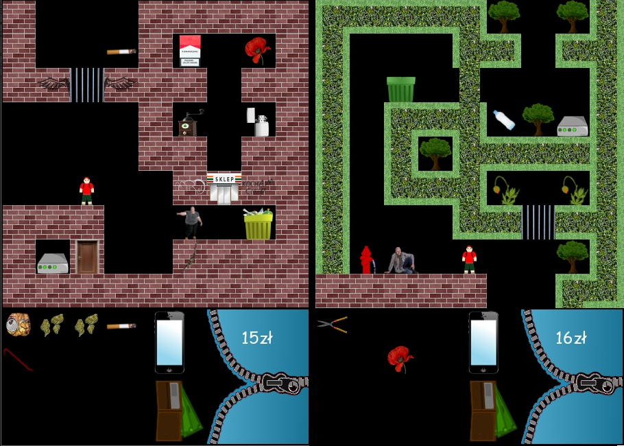

# seba-game (Object-Oriented Programming) - version 2.1
My first major project - simple rpg-parody game written using python (pygame). This is second version of "Seba" - this time I changed the way the code is written, using elements of object-oriented programming (added moduls in separate files).

## How to run "Seba"?
You will need python3 and pygame library.
- fork and clone repository or download all files,
- create virtualenv, using: **virtualenv -p python3 env**,
- run virtualenv, using: **source env/bin/activate**,
- instal pygame, using: **pip3 install -r requirements.txt**,
- run file **seba_oop.py**, using python (in console: **python3 seba_oop.py**)

## How to play "Seba"?
Use arrow keys to move Seba, run away home and try to survive in the yards and streets of Wrocław.

## Age category (PEGI 16)
Due to the presence of alcohol and drug-related content in the game, as well as morally questionable decisions made by the characters, I have determined the age category for 16 years.

Enjoy :)
